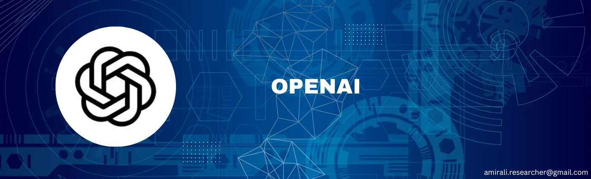

This repository is all about my OpenAI learning journey, where I explored, practiced, and built applications using state-of-the-art AI models. Through this training, I gained hands-on experience in various AI capabilities, including text generation, multimodal AI, fine-tuning, and real-time chatbot development.

### Key Learnings & Practical Implementations
#### 1. Completion & Chat Completion AI
Understanding prompt engineering, response optimization, and advanced conversation handling.  
#### 2. Function Calling API
Integrating AI with external APIs for dynamic and interactive applications.  
#### 3. Audio-to-Text (Whisper Model)
Converting speech into text with high accuracy.  
#### 4. Image-to-Text (DALL·E Model)
Generating and interpreting images using AI.  
#### 5. Fine-Tuning GPT
Training and customizing GPT models with domain-specific data.  
#### Building a Telegram Bot
Implementing a real-world chatbot using OpenAI’s latest GPT models.  
 
 
### Reference
 https://platform.openai.com/docs/overview
